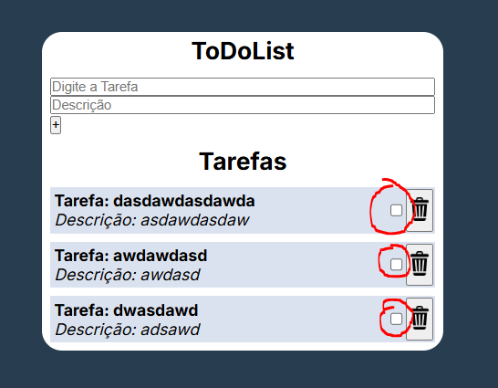
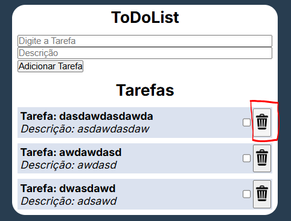

# Front-End - Gerenciador de Tarefas

## Consumindo api [gerenciador de tarefas](https://github.com/Lord1nho/backend_GerenciadTarefas)

##

## Guia de Instalação

1. Clone esse repositório (recomendado fazer um fork) na sua máquina utilizando o comando:
`git clone @webURLdoprojeto`
2. Abra um terminal na pasta que o projeto foi clonado (cmd do Windows ou terminal da IDE que vc estiver utilizando)
3. Utilize o comando `npm i` para instalar as dependências do projeto
4. Tudo Pronto, você pode rodar o seu projeto utilizando o `npm run dev` E utilizar postman ou insomnia para testar as requisições. <3
---
## Páginas e Funcionalidades
>Login e Register
- `Login e Register`: As Duas páginas responsáveis pelo cadastro e login de cada usuário, fazendo requisições ao back-end. 
- Com o usuário logado no sistema, atributos como o `accessToken`, `refreshToken` e `userId` são salvos em localStorage na sessão para serem utilizados pelo front e pelo back-end, quando forem solicitados.
- Os dados contidos no LocalStorage são limpos após o usuário fazer `logout`. 
> HomeScreen
- É a página do Gerenciador de Tarefas em si
- Após o login do usuário, ele poderá:
1. Criar Tarefas
- O usuário pode digitar o nome e descrição da tarefa.
2. Marcar Tarefas como feitas
- O usuário pode marcar a checkbox caso ele tenha finalizado a tarefa

- Após a página ser atualizada (inclusão de novo item, ou recarregamento da página) o item desaparecerá da lista de tarefas a serem concluídas
3. Excluir Tarefas
O usuário poderá excluir tarefas utilizando o ícone da lixeira.

>Botão Logout
No momento que o usuário desejar encerrar sua sessão, todos os campos salvos em localStorage serão limpos e o usuário deverá se autenticar novamente para usufruir dos serviços

---
## Referências e documentação

- [Documentação do framework NextJS](https://nextjs.org/)
- [Back-end para requisições Gerenciador de Tarefas](https://github.com/Lord1nho/backend_GerenciadTarefas)
